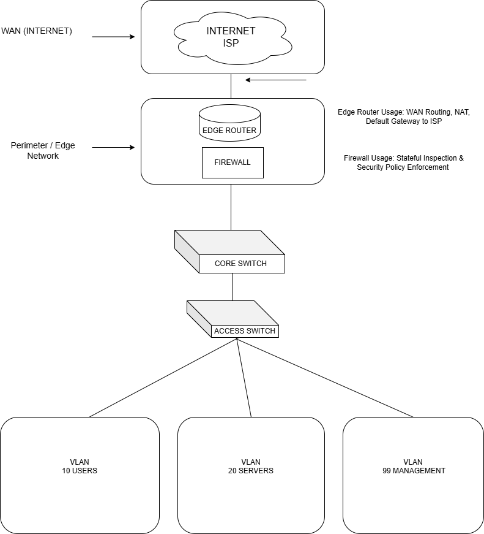

## Network Troubleshooting & Performance Optimization  
### Mock Incident Case Study

---

### Scenario Overview

Users reported slow network performance and intermittent connectivity when accessing internal application servers during business hours.

The issue impacted multiple departments and was most noticeable during peak usage periods. No complete outages were observed.

---

### Initial Symptoms

- Slow application response times  
- Occasional packet loss  
- Users reporting intermittent “network drops”  
- Degraded performance without total service failure  

---

### Troubleshooting Methodology

A structured, layered troubleshooting approach was used, aligned with OSI model principles:

1. Verified physical connectivity and interface status  
2. Checked VLAN configuration and switch port assignments  
3. Reviewed routing paths and default gateway configuration  
4. Analyzed traffic flow and identified congestion points  

---

### Root Cause Identified

The root cause was identified as an **improper VLAN trunk configuration**, which allowed unnecessary VLANs to propagate across trunk links.

This misconfiguration caused excessive broadcast traffic to traverse segments that did not require access, resulting in congestion and degraded performance during peak usage hours.

---

### Resolution Steps

- Corrected trunk port VLAN allowances  
- Restricted unnecessary VLAN propagation  
- Verified correct access VLAN assignments on edge ports  
- Validated routing paths and gateway behavior  

---

### Performance Outcome

After remediation:

- Network latency was reduced  
- Packet loss was eliminated  
- Application response times returned to normal  
- Network stability improved during peak business hours  

---

### Lessons Learned

- Proper VLAN segmentation is critical for network performance  
- Misconfigured trunk ports can impact multiple departments  
- A structured troubleshooting process prevents guesswork  
- Clear documentation accelerates issue resolution  

---

### Optimization Recommendations

- Perform periodic configuration reviews  
- Monitor traffic patterns during peak usage hours  
- Maintain clear and updated VLAN documentation  
- Enforce standardized change management procedures  

---

📌 **Note:** This was a controlled mock scenario designed to demonstrate professional network troubleshooting and performance optimization methodology.

