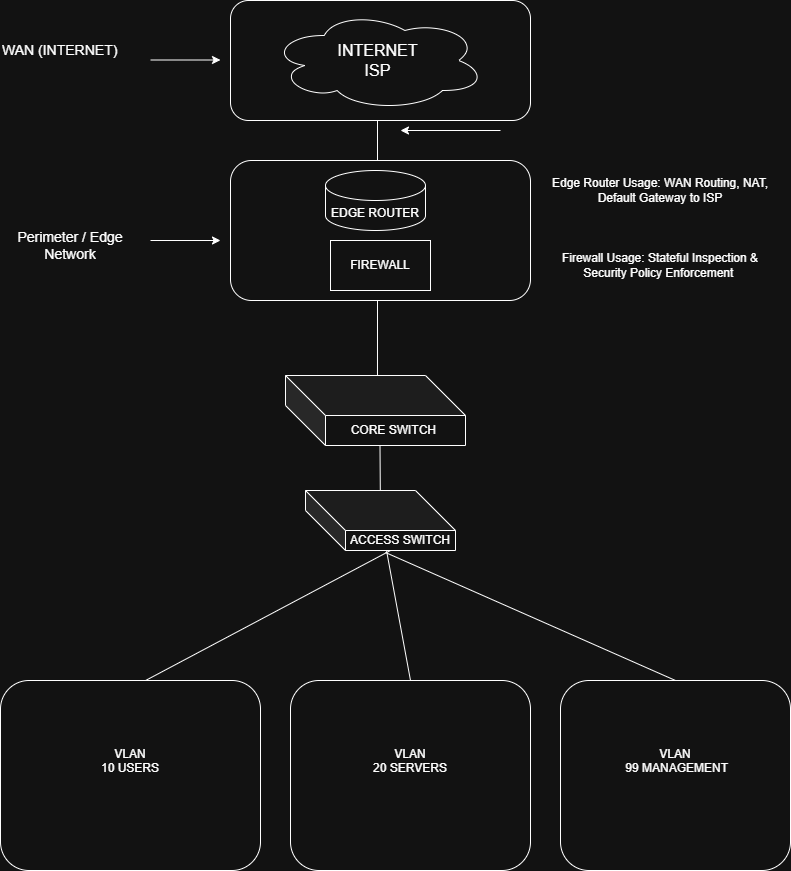

# Network Security Baseline Assessment
## Mock Assessment Report

## Purpose
## Deliverables
- Baseline Network Topology Diagram
- Security Baseline Assessment Report
- Security Baseline Checklist

This security baseline assessment evaluates the current network security posture by reviewing architecture, segmentation, access controls, and exposure points.

This assessment is non-invasive and does not include penetration testing or exploitation.

---

## Scope of Assessment
The assessment covered:
- Network segmentation and VLAN design
- Perimeter security controls
- Device access and management exposure
- Basic security hygiene and visibility
- Documentation and operational gaps

## Methodology
This assessment was conducted by inspecting available network documentation, reviewing logical topology, and analyzing the presence and configuration of key security controls. No active scanning or simulated attacks were performed.

The assessment did not include:
- Active exploitation
- Vulnerability scanning
- Password testing
- Red team activities

---

## Environment Overview
The environment consists of:
- Internet-facing edge router
- Stateful firewall at the perimeter
- Core and access switching layers
- Segmented VLANs for users, servers, and management

---

## Key Observations
- Network segmentation is present but not consistently enforced
- Management access exists but lacks strict isolation controls
- Firewall rules are functional but not regularly reviewed
- Limited visibility into traffic patterns and logging

---

## Risk Assessment Summary

### High Risk
- VLAN trunk configured without strict controls, increasing potential for unnecessary broadcast propagation and lateral movement between security zones.

### Medium Risk
- Management VLAN access not fully restricted
- Limited monitoring and alerting visibility

### Low Risk
- Firewall in place with stateful inspection
- Logical segmentation implemented

---

## Recommendations
- Restrict trunk VLAN allowances to required VLANs only
- Enforce strict management network isolation
- Implement routine firewall rule reviews
- Improve logging and monitoring visibility
- Maintain updated network documentation

---

## Conclusion
The network demonstrates foundational security controls but would benefit from tighter segmentation enforcement, improved access controls, and enhanced visibility.

This baseline assessment provides a starting point for targeted security improvements and ongoing network hardening.

