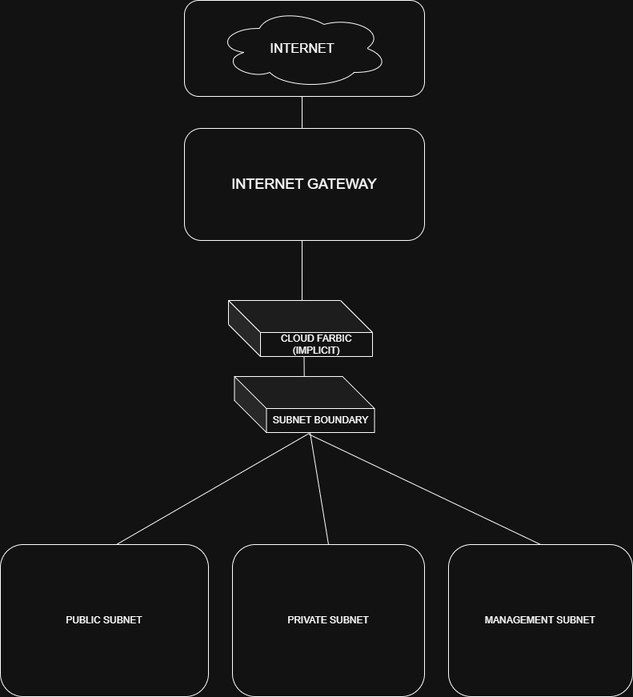

# Cloud Network Fundamentals
## Sample Cloud Network Architecture

## Purpose
This document demonstrates foundational cloud networking concepts, including virtual network design, segmentation, routing, and security boundaries.

The architecture presented is a conceptual example used to illustrate best practices in cloud-based networking environments.

---

## Cloud Concepts Covered
- Virtual Private Cloud (VPC / VNet)
- Public and private subnet separation
- Internet gateway
- Route tables
- Security groups / network security rules

---

## Architecture Overview
The cloud network consists of:
- A virtual private cloud
- A public subnet hosting internet-facing resources
- A private subnet hosting internal services
- An internet gateway providing controlled external access
- Route tables governing traffic flow

---

## Traffic Flow Explanation
- Internet traffic enters the cloud through the internet gateway
- Public subnet resources handle external communication
- Private subnet resources are isolated from direct internet access
- Internal traffic is restricted by routing and security rules

---

## Security Considerations
- Separation of public and private subnets reduces attack surface
- Security groups enforce least-privilege access
- Private resources are not directly exposed to the internet

---

## Conclusion
This architecture demonstrates foundational cloud networking principles required for secure and scalable deployments. These concepts form the basis for more advanced cloud and hybrid networking designs.

